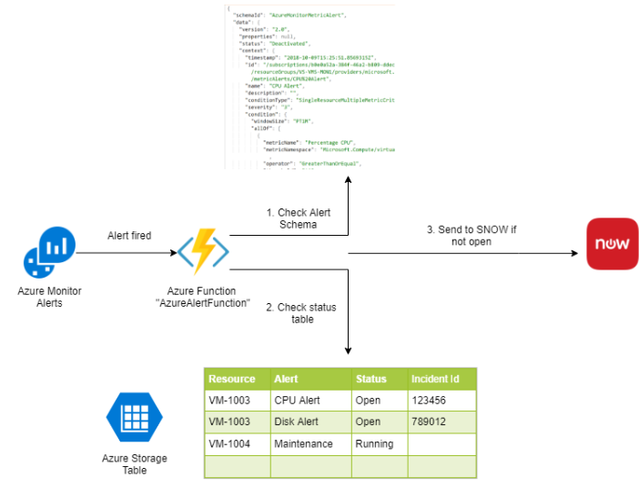

# Azure Alert Hub
A project to collect, filter and forward alerts in Azure to a Service Management system such as ServiceNow (for incident management), mute further alerts until a confirmation is sent from the Service Management system to prevent event flooding, and provide a return-channel to get an incident update to close the alert.

## Flow 1: Alert Action
An Alert from Azure Monitor triggers the Azure Function "AzureAlertFunction" creating an entry in the Alerts table, and incrementing the count with every new alert with the same keys.

## Flow 2: Service Management Confirmation
The Service Management system confirms that the incident is closed, alert is removed from the Alerts table, any new Alert will create a new Incident / start a new count.

# Installation / Configuration
Deploy the Azure Functions project here to Azure, and configure the environment variable StorageConnectionString to point to an Azure Storage account to store the event data, along with the other environment variables to configure the communication to the Service Management system.

After the functions are configure, configure the Function AzureAlertFunction to be the trigger for any Azure Monitor alerts.  When the alerts are triggered, you will see them in the Storage Account under Tables > Alerts and AlertIncidents.

## Environment Variables
These environment variables must be configured for the functions to work correctly.

### Required 

- **AzureWebJobsStorage**: "The storage connection string for the web jobs (required)"
- **FUNCTIONS_WORKER_RUNTIME**: must be set to "dotnet"
- **StorageConnectionString**: The storage connection string for the alert tables
- **ServiceManagementType**: Either "TEST" for a test service management service or "SNOW" for ServiceNow
- **AlertRegularExpression**: Regular expression to check for a pattern in the alert payload, useful for database checks or any other special logic (results are added to alert key to determine if an incident is unique)

### Variables only for ServiceNow configuration (ServiceManagementType="SNOW")
- ServiceManagementUrl: If ServiceManagementType is set to SNOW, the URL where ServiceNow can be reached
- ServiceManagementCallerId: A caller_id property which is forwarded to SNOW
- ServiceManagementUser": A user property which is forwarded to SNOW
- ServiceManagementBusinessService: A business_service property which is forwarded to SNOW
- ServiceManagementITService: An it_service property which is forwarded to SNOW
- ServiceManagementContactType: a phone property which is forwarded to SNOW
- ServiceManagementAssignmentGroup: An assignment_group property which is forwarded to SNOW
- ServiceManagementGroupFamily: A group_family property which is forwarded to SNOW
- ServiceManagementLocation: A location property which is forwarded to SNOW
- ServiceManagementGravity": A gravity property which is forwarded to SNOW
- ServiceManagementImpact": An impact property which is forwarded to SNOW

# Usage

You will also see that multiple events only increases the Counter property, and does not create new entries.  This goes the same for calling the Service Management system.

After events have been stored, you can confirm them by calling the **AzureAlertConfirmFunction** with the incident id, which should then remove all entires of the event from the Alerts and AlertIncidents tables, which will allow a new event to start the process all over again.

